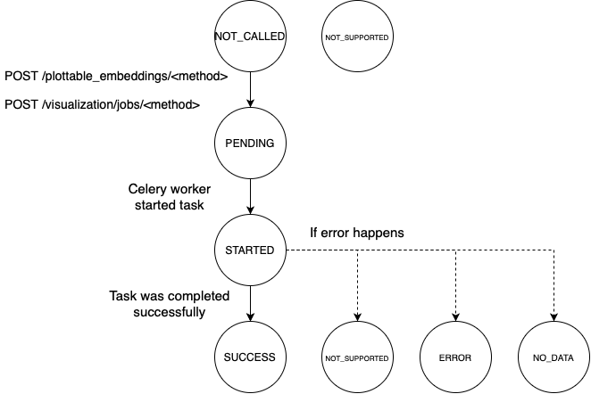

# hydro-visualization
Service for visualization of high dimensional for hydrosphere

## DEPENDENCIES

```python
DEBUG_ENV = bool(os.getenv("DEBUG_ENV", True))
APP_PORT = int(os.getenv("APP_PORT", 5000))
GRPC_UI_ADDRESS = os.getenv("GRPC_UI_ADDRESS", "localhost:9090")
HS_CLUSTER_ADDRESS = os.getenv("HTTP_UI_ADDRESS", "http://localhost")
SECURE = os.getenv("SECURE", False)
MONGO_URL = os.getenv("MONGO_URL", "mongodb")
MONGO_PORT = int(os.getenv("MONGO_PORT", 27017))
MONGO_AUTH_DB = os.getenv("MONGO_AUTH_DB", "admin")
MONGO_USER = os.getenv("MONGO_USER")
MONGO_PASS = os.getenv("MONGO_PASS")
AWS_STORAGE_ENDPOINT = os.getenv('AWS_STORAGE_ENDPOINT', '')
FEATURE_LAKE_BUCKET = os.getenv('FEATURE_LAKE_BUCKET', 'feature-lake')
HYDRO_VIS_BUCKET_NAME = os.getenv('BUCKET_NAME', 'hydro-vis')
```

## Assumptions:

- Model must have in it's contract **'embedding'** output
- If model returns class prediction and confidence these fields should be named **'class'** and **'confidence'** respectively
- Only data (embeddings) from requests will be visualized. Training data is used only for accurate transformation. 

## API

### Task states:



Whole API description is available [here](openapi.yaml)

1.**POST** /visualization/plottable_embeddings/umap?model_version_id=2
    
    transformer - manifold learning transformer from ["umap", "trimap", "tsne"]. For now only ["umap"].
 

  response json:
```json
{"task_id":  "22e86484-7d90-49fd-a3e1-329b978ee18c"}
```

2. **POST** /visualization/jobs/<method>?model_version_id=2


  response json:
```json
{"task_id":  "22e86484-7d90-49fd-a3e1-329b978ee18c"}
```
3. **GET** /visualization/jobs?task_id=22e86484-7d90-49fd-a3e1-329b978ee18c

Returns state of a task and result if ready

   response_json(SUCCESS):
```json
{
      "result": {"data_shape": [2, 2],
                 "data": [[0.1, 0.2], [0.3, 0.4]],
                "request_ids": [200,2001],
                 "class_labels": {
                                 "confidence": {"data": [0.1, 0.2, 0.3],
                                                 "coloring_type":  "gradient"},
                                 "class": {"data": [1, 2, 1, 3, 1],
                                           "coloring_type":  "class",
                                           "classes":  [1, 2, 3]}
                                   },
                 "metrics": {
                             "anomality": {
                                           "scores": [0.1, 0.2, 0.5, 0.2],
                                           "threshold": 0.5,
                                           "operation": "Eq",
                                           "coloring_type": "gradient"
                                           }
                             },
                 "top_100": [[2, 3, 4], []],  
                 "visualization_metrics": {
                                           "global_score": 0.9,
                                           "sammon_error": 0.1,
                                           "msid_score": 200
                                           }
                 },
      "state":  "SUCCESS",
      "task_id": "22e86484-7d90-49fd-a3e1-329b978ee18c",
      "description": ""

}
```

   response_json (PENDING):
```json
{
    "state": "PENDING",
    "task_id": "22e86484-7d90-49fd-a3e1-329b978ee18c"
}
```

2. **POST** /visualization/params/<method>?model_version_id=2
  
    **request format**:
    ```json
     {
        "parameters": {
        "metric": "euclidean",
        "min_dist": 0.1,
        "n_components": 2,
        "n_neighbours": 15
      },
       "production_data_sample_size": 500,
       "training_data_sample_size": 5000,
       "visualization_metrics": [
         "global_score"
      ]
    }

    ```

   
   - parameters: dict of transfomer parameters. Different set of parameters for different transformer used.
. 
   
    **response**:
    200 - Success

3. **GET** /visualization/params/<method>?model_version_id=2

    **response format**:
    ```json
     {
        "parameters": {
        "metric": "euclidean",
        "min_dist": 0.1,
        "n_components": 2,
        "n_neighbours": 15
      },
       "production_data_sample_size": 500,
       "training_data_sample_size": 5000,
       "visualization_metrics": [
         "global_score"
      ]
    }

    ```


4. **GET** /visualization/supported?model_version_id=2

   **response**:
   
   ```json
    {"supported": true, "message":""}, 200
    {"supported": false, "message":"Some message"}, 200
    ```

## **Projector params**:
    
```json
{
 "properties": {
            "metric": {
                "type": "string",
                "default": "euclidean",
                "enum": [ "euclidean", "manhattan", "chebyshev", "minkowski", "canberra", "braycurtis", "haversine", 
                           "mahalanobis", "wminkowski", "seuclidean", "cosine", "correlation", "hamming", "jaccard",
                            "dice", "russellrao", "kulsinski", "rogerstanimoto", "sokalmichener", "sokalsneath", "yule"]
            },
            "min_dist": {
                "type": "number",
                "default": 0.1,
                "examples": [
                    0.1
                ],
                "maximum": 0.99,
                "minimum": 0.0
            },
            "n_components": {
                "type": "integer",
                "default": 2,
                "examples": [
                    2
                ],
                "maximum": 3,
                "minimum": 2
            },
            "n_neighbours": {
                "type": "integer",
                "default": 15,
                "examples": [
                    15
                ],
                "maximum": 200,
                "minimum": 2
            },
 "production_data_sample_size": {
        "type": "integer",
        "default": 500,
        "examples": [
            500
        ],
        "maximum": 5000,
        "minimum": 20
    },
    "training_data_sample_size": {
        "type": "integer",
        "default": 5000,
        "examples": [
            5000
        ],
        "maximum": 10000,
        "minimum": 20
    },
    "visualization_metrics": {
        "type": "array",
        "default": ["global_score"],
        "enum": ["global_score", "sammon_error", "auc_score", "stability_score", "msid", "clustering"]
}
```

## Demo
1. set environment variables: AWS_ACCESS_KEY, AWS_SECRET_KEY
2. upload demo/adult/model and demo/adult/monitoring_model
2. send request 

POST /visualization/plottable_embeddings/umap?model_version_id=2

### Database schema 

documents: key - model_name: model_version
collection: umap, trimap, tsne

- add created field

```json
{
"model_version_id": "2",
"result_file": "s3://hydro-vis/adult_scalar/2/result.json",
"transformer_file": "s3://hydro-vis/adult_scalar/2/umap_transformer",
"parameters": {
        "metric": "euclidean",
        "min_dist": 0.1,
        "n_components": 2,
        "n_neighbours": 15
      },
"production_data_sample_size": 500,
"training_data_sample_size": 5000,
"visualization_metrics": ["global_score"]
}
```

transformed_embeddings - files that store transformed embeddings with labels and other monitoring numbers

transformer structure


transformed embeddings file format:
parquet

label, confidence, transformed_embedding(vec), score1, score1_thresh, score2, score2_thresh, …
 