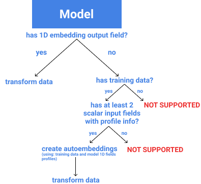

# Hysrosphere visualization service

Contents:

[API](../openapi.yaml)

[Transformation pipeline](#transformation-pipeline)

[Manifold Learning Transformers](#manifold-learning-transformers)

# DEPENDENCIES
```python
DEBUG_ENV = bool(os.getenv("DEBUG_ENV", False))
APP_PORT = int(os.getenv("APP_PORT", 5000))
GRPC_PORT = os.getenv("GRPC_PORT", 5001)
GRPC_PROXY_ADDRESS = os.getenv("GRPC_PROXY_ADDRESS", "localhost:9090")
HS_CLUSTER_ADDRESS = os.getenv("HTTP_PROXY_ADDRESS", "http://localhost")
SECURE = os.getenv("SECURE", False)
MONGO_URL = os.getenv("MONGO_URL", "mongodb")
MONGO_PORT = int(os.getenv("MONGO_PORT", 27017))
MONGO_AUTH_DB = os.getenv("MONGO_AUTH_DB", "admin")
MONGO_USER = os.getenv("MONGO_USER")
MONGO_PASS = os.getenv("MONGO_PASS")
AWS_STORAGE_ENDPOINT = os.getenv('AWS_STORAGE_ENDPOINT', '')
AWS_REGION = os.getenv('AWS_REGION', '')
HYDRO_VIS_BUCKET_NAME = os.getenv('AWS_BUCKET', 'visualization-artifacts')
AWS_SECRET_ACCESS_KEY = os.getenv('AWS_SECRET_ACCESS_KEY', '')
AWS_ACCESS_KEY_ID = os.getenv('AWS_ACCESS_KEY_ID', '')
EMBEDDING_FIELD = 'embedding'
MINIMUM_PROD_DATA_SIZE = 10
N_NEIGHBOURS = 100
```


# Transformation pipeline
Transformation consists of three main stages: 

1. Collecting model embeddings from training and production data or generating them automatically
2. Transforming collected embeddings from N dimension to 2 dimensions
3. Caching results

## Supported logic:


## Collecting model embeddings

Model has two resources of data: training data (it is uploaded to S3 storage during model upload) and production data - all requests that go through model. 
[Transformation task](../app/transformation_tasks/tasks.py) starts with collecting this data. 

### Get Embeddings
If model has it's own embeddings in return field `embedding` we retrieve that info

**Method: [get_embeddings](../app/transformation_tasks/tasks.py)**

#### Training data
First, service requests path to training data:

```
GET {CLUSTER_URL}/monitoring/training_data?modelVersionId={model.id}
```


However, training data usually contains only model inputs and labels, it does not have any model embeddings. To produce such embeddings we create a shadowless servable of a model and send training data as separate requests.
We do this in order to not litter unwanted requests in model monitoring. 

> If model has no training data, we ignore this step and set `training_embeddings` to `None`. This data is not required, but it is recommended to have it for more accurate transformation. 

#### Production data
For visualization we do not use all produciton data, instead we request a subsample of data of size which is configurable 

``
GET {CLUSTER_URL}/monitoring/checks/subsample/{model_id}?size={size}
``

Production sample is a dataframe that contains not only embeddings but also all request information. Firstly, embeddings are extracted from dataframe. Method **[parse_embeddings_from_dataframe](../data_management.py)**

> If model has no `embedding` field in it's outputs, then we cannpt extract embeddings and visualization task is stopped and return message that model has no `embedding` field. 

Secondly, we extract additional information about requests:

- discrete labels/classes (1D model output with certain profile [categorical, ordinal and nominal])
- continuous labels/confidence (1D model output with certain profile [numerical, continuous, ratio and interval])
- monitoring metrics return values, thresholds and comparison operator
- N nearest neighbours (for each request) in original embedding space
- N Closest counterfactuals (nearest requests with different labels)

More in: 

**Method: [parse_requests_dataframe](../app/utils/data_management.py)**

All this additional labeling data is used to color visualization. In UI you can choose how to assign colors to data points:
For continuous values (ex. confidence score) `gradient` coloring is used.

> In visualization even though monitoring metrics return continuous scores, each score is thresholded using metric threshold and comparison operator. Thus requests will be colored in only two colors.

### Generate Embeddings

To generate embeddings we use 1D model inputs with profile info to train various scalers and encoders. 
For each input field we infer transformation type from certain profile->transformation mapping.

**Code: [autoembeddings](../app/ml_transformers/autoembeddings.py)**

```python
class TransformationType(Enum):
    ONE_HOT = 0
    ORDINAL = 1
    ROBUST = 2
    NO_TRANSFORMATION = 3
    IGNORE = 4
```
Mapping:

```python
PROFILE_TYPE_TO_TRANSFORMATION = {ProfilingType.NONE: TransformationType.IGNORE,
                                  ProfilingType.CATEGORICAL: TransformationType.ONE_HOT,
                                  ProfilingType.NOMINAL: TransformationType.ONE_HOT,
                                  ProfilingType.ORDINAL: TransformationType.ORDINAL,
                                  ProfilingType.NUMERICAL: TransformationType.ROBUST,
                                  ProfilingType.CONTINUOUS: TransformationType.ROBUST,
                                  ProfilingType.INTERVAL: TransformationType.NO_TRANSFORMATION,
                                  ProfilingType.RATIO: TransformationType.NO_TRANSFORMATION,
                                  ProfilingType.IMAGE: TransformationType.IGNORE,
                                  ProfilingType.VIDEO: TransformationType.IGNORE,
                                  ProfilingType.AUDIO: TransformationType.IGNORE,
                                  ProfilingType.TEXT: TransformationType.IGNORE}

```

For each suitable input encoder is generated using training data to train encoder. 

## Transforming embeddings
Both training and production embeddings are passed to instance of manifold-learning transformer ([transformer](../ml_transformers/transformer.py)).
If transformer instance is cached, then we use method transformer.transform, which does not invoke training of transformer.
If we do not have pretrained saved transformer instance, we use transformer.fit_transform, which trains transformer with all available data.

**Method: [perform_transform_task](../app/transformation_tasks/tasks.py)**
 
After transforming, embeddings are evaluated using specific metric that can estimate how good we fitted N-dimensional embeddings in 2-dimensional space.

## Caching results in Mongo
```python
{"model_version_id": model_version_id,
                "result_file": "", # path to file on S3
                "transformer_file": "", # path to file on S3
                "encoder_file": "", # path to autoembeddings encoder joblib file on S3 (if autoembeddings are used)
                "parameters": DEFAULT_TRANSFORMER_PARAMETERS[method],
                "visualization_metrics": DEFAULT_PROJECTION_PARAMETERS['visualization_metrics'],
                "production_data_sample_size": DEFAULT_PROJECTION_PARAMETERS['production_data_sample_size'],
                "training_data_sample_size": DEFAULT_PROJECTION_PARAMETERS['training_data_sample_size']}
```

Inferencing embeddings and training transformer is time-consuming. For that we store latest results of transformation and pretrained transformer on S3 bucket `hydro-vis`. 
Path to these files are stored in mongodb. 

## Refitting data

After certain amount of requests we need to refresh our data, so we need to refit new requests or sometime we need to retrain transformer on new data.
To do this task there is GRPC service that allows to refit transformer on new subsample with saved configuration and save result on S3. Next time on UI user will see new data.

**Code: [grpc_app](../app/grpc_app.py)**

## Changing config parameters

Sometimes we need to change some transfomer parameters or projection parameters. 
Parameters:

```python
AVAILBALE_VIS_METRICS = list(VisMetrics)

AVAILABLE_TRANSFORMERS = {'umap'}  # {'umap', 'tsne', 'trimap'}. For now only one algorithm
DEFAULT_TRANSFORMER_PARAMETERS = {'umap':
                                      {'min_dist': 0.1, 'n_neighbours': 15, 'metric': 'euclidean', 'n_components': 2},
                                  'umap_mixed':
                                      {'min_dist': 0.1, 'n_neighbours': 15, 'metric': 'euclidean', 'n_components': 2,
                                       'categorical_weight': 0.9}
                                  }

DEFAULT_PROJECTION_PARAMETERS = {'parameters': DEFAULT_TRANSFORMER_PARAMETERS,
                                 'use_labels': False, # do we need to use labels for more precise projections
                                 'visualization_metrics': [VisMetrics.GLOBAL_SCORE.value],
                                 'training_data_sample_size': 5000,
                                 'production_data_sample_size': 500}

```

# Manifold Learning Transformers
Manifold learning is an approach to nonlinear dimensionality reduction. It is used to visualize high-dimensional datasets.
The simplest way to somehow visualize this data in 2D/3D is by taking a random projection of the data. 
Though this allows some degree of visualization of the data structure, the randomness of the choice leaves much to be desired. 
In a random projection, it is likely that the more interesting structure within the data will be lost.[[1]](https://scikit-learn.org/stable/modules/manifold.html)
Numerous manifold learning algorithms were created to extract useful patterns in manifold and preserve them in projection: 
TSNE, TRIMAP, UMAP, Large-Vis, Sammon's mapping. 

Effect of ml algorithm on preserving manifold structure in visualization[[2]](https://arxiv.org/pdf/1802.03426.pdf):


## Abstract interface
In this service common to scikit-learn algorithms interface was used.
In [ml_transformers.transformer](../app/ml_transformers/transformer.py) class Transformer defines interface for all transformers that could be used

```python
class Transformer(ABC):
    def __init__(self, parameters: Dict):
        self.__set_params__(parameters)
        self.__instance__, self.transformer = self.__create__()  # clear instance of transformer (not fitted into data)
```
- **parameters** - is a dict that defines transformer parameters. 
We use this parameters in comparing transformers, storing in database and in requests.

- **instance** - it is a clear instance of transformer with same parameters. It is used for stability metric.
- **transformer** - it is an instance of transformer which is used for fitting.

```python
    @abstractmethod
    def fit(self, X: np.ndarray, y=None):
        pass

    @abstractmethod
    def transform(self, X: np.ndarray, y=None) -> np.ndarray:
        return None

    @abstractmethod
    def fit_transform(self, X: np.ndarray, y=None) -> np.ndarray:
        return None
```
- **fit** - it accepts points in N dimensional space, fits transformer.
- **transform** - it accepts points in N dimensional space and transforms points without fitting transformer to 2D/3D. Returns points in lesser dimension.
- **fit_transform** - it accepts points in N dimesninal space and fits transformer in manifold of those points and transforms points to 2D/3D.  Returns points in lesser dimension.

> In transform we assume that self.transformer is already fitted in some manifold. If it is not, then use transformer.fit

```python
 def eval(self, X: np.ndarray, _X: np.ndarray, y=None,
             evaluation_metrics=("global_score", "sammon_error",
                                 "auc_score", "stability_score", "msid", "clustering"),
             _auc_cv=5) -> Dict[str, str]:
     """
        Evaluates vizualization using listed evaluation_metrics names
        :param X: original points
        :param _X: transformed points
        :param y: labels
        :param evaluation_metrics: list of metrics names
        :param _auc_cv: number of splits for acc evaluation
        :return: dict of metric values
        """
```

**eval** - it uses points in original space and transformed to evaluate them given a list of metrics. For some metrics, class labels are needed.
If `y` labels are not provided then metrics `clustering` and `auc_score` will not be used. This method is already implemented. 


## Visualization metrics

[ml_transformers.metrics](../ml_transformers/metrics.py)

Manifold learning transformers have many parameters. For various manifolds we need different configuration to achieve good visualization. 

Good visualization should show: 
- good cluster separation
- class separation
- outliers are seen as outliers on data
- concept drift if it is present

To evaluate how good is your visualization reflecting all this features and manifold structure we created several metrics.
Each metric aims to show you only one aspect of goodness of your visualization. 

### Global Score

Source: https://github.com/eamid/trimap

Global score - measure of goodness of low-dimensional embedding in reflecting global structure.

**Idea:**

for n points:

X - high dimensional data points - in Rm. X is a matrix n x m

Y - low dimensional data points - in Rd. Y is a matrix n x d

**Minimum reconstruction error**

%20&=\min%20\|X-A%20Y\|_{F}^{2}%20\\%20\text%20{where}\|.\|%20&-\text%20{Frobenius%20norm}%20\end{aligned})


**Optimal value for MRE**

^{-1})

**Global score**


```python
def global_score(X: np.ndarray, Y: np.ndarray) -> np.float:

```

- **X** - points in original space
- **Y** - points in transformed space

### Auc score

It measures how good simple classification algorithms such as [SVC](https://scikit-learn.org/stable/modules/generated/sklearn.svm.SVC.html) and [KNN](https://scikit-learn.org/stable/modules/generated/sklearn.neighbors.KNeighborsClassifier.html)
perform on classifying points in transformed space. So, basically, it shows how good classes are separated from each other in visualization.

```python
def auc_score(X: np.ndarray, y: np.ndarray, cv=5, splits=None) -> Dict[str, np.float]:
```

- **X** - points in transformed space.
- **y** - labels.
- **cv** - number of cross-validation splits.
- **splits** - ready indexes of splits. If splits are provided, then cv is ignored.

### Stability score

Measures stabilty of embedding by subsampling from data, fitting sample and full data and measuring Procrustes distance
between two potentially comparable distributions. From https://arxiv.org/abs/1802.03426

Idea: 

1. Fit all data X -> Y (dim 2) and fit only subsample X' -> Y'
2. Compute procrustes distance between corresponding points in Y {y1, y2, ... yi} and Y' {y'1, y'2, ... y'i}
such that yi corresponds to y'i. 

Procrustes distance finds optimal rotation and translation of Y' such that MSE between Y and Y'(translated) is minimal.

=\sqrt{\sum_{i=1}^{N}\left(x_{i}-y_{i}^{\prime}\right)^{2}})

```python
def stability_score(X: np.ndarray, transformer, sample_indices=None, sample_size=0.1):
```

- **X** - points in original space
- **transformer** - transformer instance (this instance is not fitted to any manifold)
- **sample_indices** - indeces of sample to refit transformer
- **sample_size** - size of sample (only if not sample indices provided)

### Sammon error

Sammons mapping stress function. 

^{2}}{d_{i%20j}^{*}})

- dij is a distance between point i and point j in original space
- d*ij is a distance between pot=int i and point j in reduced space

```python
def sammon_error(X: np.ndarray, _X: np.ndarray, distance_metric=lambda x1, x2: np.linalg.norm(x1 - x2)):
```
- **X** - points in original space
- **_X** - poins in transformed space
- **distance_metric** -  Callable - f(x1, x2)-> float

### Intristic Multiscale score
Computes MSID score (https://arxiv.org/abs/1905.11141) for embeddings

```python
def intristic_multiscale_score(X: np.ndarray, _X: np.ndarray) -> float:
```
- **X** points in original space
- **_X** points in transformed space

### Clustering score
This score is similar to auc score, it also uses class labels. Idea is to cluster unsupervisely points in transformed space
and measure how much unsupervised clustering labels are similar to real class labels. 

To measure this quality of clusterization two metrics are used:
   - [adjusted random score](https://scikit-learn.org/stable/modules/generated/sklearn.metrics.adjusted_rand_score.html)
   - [mutual info score](https://scikit-learn.org/stable/modules/generated/sklearn.metrics.adjusted_mutual_info_score.html)

```python
def clustering_score(_X: np.ndarray, y: np.ndarray) -> (float, float):
```

- **_X** - points in transformed space
- **y** labels


