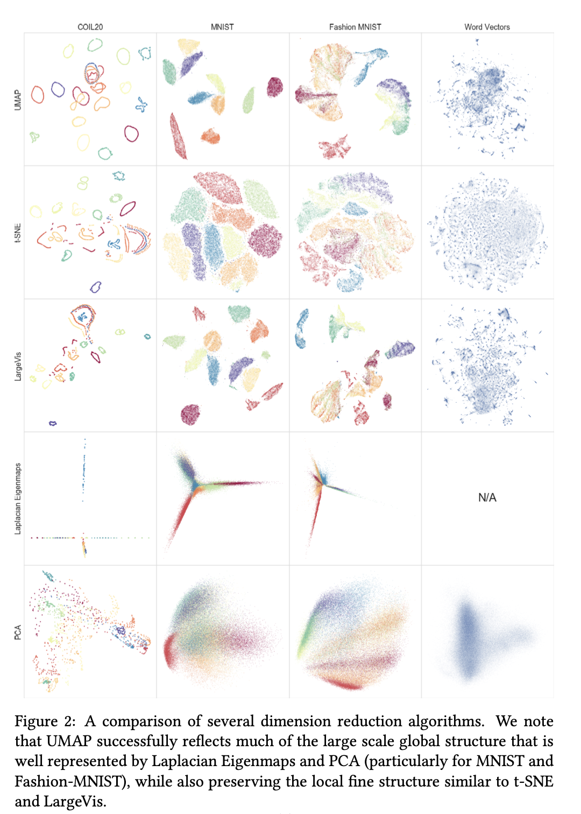

# Hysrosphere visualization service

# DEPENDENCIES

```python
DEBUG_ENV = bool(os.getenv("DEBUG_ENV", True))
APP_PORT = int(os.getenv("APP_PORT", 5000))
SERVING_URL = os.getenv("SERVING_URL", "managerui:9090")
CLUSTER_URL = os.getenv("CLUSTER_URL", "http://localhost")
SECURE = os.getenv("SECURE", False)
MONGO_URL = os.getenv("MONGO_URL", "mongodb")
MONGO_PORT = int(os.getenv("MONGO_PORT", 27017))
MONGO_AUTH_DB = os.getenv("MONGO_AUTH_DB", "admin")
MONGO_USER = os.getenv("MONGO_USER")
MONGO_PASS = os.getenv("MONGO_PASS")
AWS_STORAGE_ENDPOINT = os.getenv('AWS_STORAGE_ENDPOINT', '')
FEATURE_LAKE_BUCKET = os.getenv('FEATURE_LAKE_BUCKET', 'feature-lake')
HYDRO_VIS_BUCKET_NAME = os.getenv('BUCKET_NAME', 'hydro-vis')
```


# API
Whole API description is available [here](../openapi.yaml).

## Request for transformed embeddings of a model to plot

- **URL**

    /visualization/plottable_embeddings/<method>
    
- **Method**

    **POST** 
- **URL Params**
    
    **method**  - name of method to use for visualization. For now only *umap*
    
- **Data Params**

    ```json
    {        "model_name": "adult_scalar",
             "model_version": 1,
             "visualization_metrics": ["global_score", "sammon_error", "auc_score", "stability_score", "msid", "clustering"]
    }
 
    ```
   model_name, model_version - name&version of a model, that should have `embedding` field in it's outputs.
   
   visualization_metrics - metrics that are used to evaluate how good will visualization reflect your real multidimensional data in 2D/3D plot. More on visualization metrics you can find [here](#visualization-metrics) 
   
   possible visualization metrics:
   
       - global_score
       - sammon_error
       - auc_score
       - stability_score
       - msid
       - clustering
   

- **Response**

    ```json
    {"task_id":  "22e86484-7d90-49fd-a3e1-329b978ee18c"}
    ```

    Service creates task and starts working on it. It is not fast (unless you have previously transformed requests for your model and not many new requests appeared since that.)
    Usually it takes from 5 to 10 minutes, but depends on:
    
      - dimensionality of your model embeddings
      - how large is your training data
      - how fast is your model
      - what metrics have you chosen (ex. stability score is very slow as it refits data several times)
    
    To get your results, you need to send request:  **GET** /visualization/jobs?task_id={YOUR-TASK-ID}

## Jobs

Visualization jobs are Celery tasks that you can invoke or get results from. 

- **URL**

    /visualization/jobs/<method>
- **Method**

    **POST** silently invokes refitting of transformer on new produciton subsample of a given model

- **URL Params**

    **method**  - name of method to use for visualization. For now only *umap*

    **refit_transformer** - if True, then transformer is refitted on new data. Otherwise, new data is inferenced using old data manifold. Default False
- **Data Params**

    ```json
    {        "model_name": "adult_scalar",
             "model_version": 1
    }
    ```
 -  **Response**
 
     ```json
        {"task_id":  "22e86484-7d90-49fd-a3e1-329b978ee18c"}
     ```
    
    Service creates task and starts working on it. To get your results, you need to send request:  **GET** /visualization/jobs?task_id={YOUR-TASK-ID}

---- 

- **URL**

    /visualization/jobs/task_id=

- **Method**
   
    **GET**  returns result of a task

- **URL Params**
    
    **task_id** - id of a task returned by POST /visualization/jobs/<method>  or POST /visualization/plottable_embeddings/<method>
   
- **Data Params**

    No
    
- **Data Params**

    No
    
- **Response**
    
    Returns state of a task and result if ready
    
    states: = ['PENDING', 'RECEIVED', 'STARTED', 'FAILURE', 'REVOKED',  'RETRY'] (Source: [Celery Docs](https://docs.celeryproject.org/en/latest/reference/celery.states.html#all-states))
    
       response_json(SUCCESS):
    ```json
    {
          "result": {"data_shape": [2, 2],
                     "data": [[0.1, 0.2], [0.3, 0.4]],
                    "request_ids": [200,2001],
                     "class_labels": {
                                     "confidence": {"data": [0.1, 0.2, 0.3],
                                                     "coloring_type":  "gradient"},
                                     "class": {"data": [1, 2, 1, 3, 1],
                                               "coloring_type":  "class",
                                               "classes":  [1, 2, 3]}
                                       },
                     "metrics": {
                                 "anomality": {
                                               "scores": [0.1, 0.2, 0.5, 0.2],
                                               "threshold": 0.5,
                                               "operation": "Eq",
                                               "coloring_type": "gradient"
                                               }
                                 },
                     "top_100": [[2, 3, 4], []],  
                     "visualization_metrics": {
                                               "global_score": 0.9,
                                               "sammon_error": 0.1,
                                               "msid_score": 200
                                               }
                     },
          "state":  "SUCCESS",
          "task_id": "22e86484-7d90-49fd-a3e1-329b978ee18c",
          "description": ""
    
    }
    ```
    
       response_json (PENDING):
    ```json
    {
        "state": "PENDING",
        "task_id": "22e86484-7d90-49fd-a3e1-329b978ee18c"
    }
    ```

 
  ## API Demo
1. set environment variables: AWS_ACCESS_KEY, AWS_SECRET_KEY
2. Upload testing [adult model](../test/adult) `hs apply -f serving.yaml` and send request using simulate traffic [script](../test/adult/demo/simulate_traffic.py)
3. Send request on plottable embeddings:

POST /visualization/plottable_embeddings/umap

```json
{        "model_name": "adult_scalar",
         "model_version": 1,
         "visualization_metrics": ["global_score", "sammon_error", "auc_score", "stability_score", "msid", "clustering"]
}
 
 
```

4. Get results:

 GET /visualization/jobs?task_id=22e86484-7d90-49fd-a3e1-329b978ee18c


# Transformation pipeline
Transformation consists of three main stages: 

1. Collecting model embeddings from training and production data
2. Transforming collected embeddings from N dimension to 2 dimensions
3. Caching results

## Collecting model embeddings

Model has two resources of data: training data (it is uploaded to S3 storage during model upload) and production data - all requests that go through model. 
[Transformation task](../transformation_tasks/tasks.py) starts with collecting this data. 

### Training data
First, service requests path to training data:

```
GET {CLUSTER_URL}/monitoring/training_data?modelVersionId={model.id}
```
**Method: [get_training_data_path](../transformation_tasks/tasks.py)**

However, training data usually contains only model inputs and labels, it does not have any model embeddings. To produce such embeddings we create a shadowless servable of a model and send training data as separate requests.
We do this in order to not litter unwanted requests in model monitoring. 
**Method: [compute_training_embeddings](../data_management.py)**

> If model has no training data, we ignore this step and set `training_embeddings` to `None`. This data is not required, but it is recommended to have it for more accurate transformation. 

### Production data
For visualization we do not use all produciton data, instead we request a subsample of data of size 1000. 

``
GET {CLUSTER_URL}/monitoring/checks/subsample/{model_id}?size={size}
``

Production sample is a dataframe that contains not only embeddings but also all request information. Firstly, embeddings are extracted from dataframe. Method **[parse_embeddings_from_dataframe](../data_management.py)**

> If model has no `embedding` field in it's outputs, then we cannpt extract embeddings and visualization task is stopped and return message that model has no `embedding` field. 

Secondly, we extract additional information about requests:

- class labels (if model has `class` in outputs)
- confidence scores (if model has `confidence` output)
- monitoring metrics return values, thresholds and comparison operator
- N nearest neighbours (for each request) in original embedding space
- N Closest counterfactuals (nearest requests with different labels)

**Method: [parse_requests_dataframe](../data_management.py)**

All this additional labeling data is used to color visualization. In UI you can choose how to assign colors to data points:
For continuous values (ex. confidence score) `gradient` coloring is used.

> In visualization even though monitoring metrics return continuous scores, each score is thresholded using metric threshold and comparison operator. Thus requests will be colored in only two colors.

## Transforming embeddings
Both training and production embeddings are passed to instance of manifold-learning transformer ([transformer](../ml_transformers/transformer.py)).
If transformer instance is cached, then we use method transformer.transform, which does not invoke training of transformer.
If we do not have pretrained saved transformer instance, we use transformer.fit_transform, which trains transformer with all available data.

**Method: [transform_high_dimensional](../visualizer.py)**
 
After transforming, embeddings are evaluated using specific metric that can estimate how good we fitted N-dimensional embeddings in 2-dimensional space.

## Caching results
```json
{
"model_name": "adult_scalar",
"model_version": "1",
"result_file": "s3://hydro-vis/adult_scalar/2/result.json",
"transformer_file": "s3://hydro-vis/adult_scalar/2/umap_transformer",
"parameters": {"n_neighbours": 15,
                  "min_dist": 0.1,
                  "metric":  "cosine"},
"use_labels": false
}
```

Inferencing embeddings and training transformer is time-consuming. For that we store latest results of transformation and pretrained transformer on S3 bucket `hydro-vis`. 
Path to these files are stored in mongodb. 

To visualize new requests post a job request:

**POST** /visualization/jobs/<method> 

**Data Params**

    ```json
    {        "model_name": "adult_scalar",
             "model_version": 1
    }
    ```


If a lot of new data came through model we need to refit transformer before inferencing new data. Because inferencing a lot of new data on old transformer will result in inaccurate visualization.
For this add refit_transformer parameter:


**POST** /visualization/jobs/<method>?refit_transformer=true

**Data Params**

    ```json
    {        "model_name": "adult_scalar",
             "model_version": 1
    }
    ```

### Mongodb

We use mongodb to store parameters of model visualization transformer. For each type of transformer we use separate collection. Structure of db record:

```json
{
"model_name": "adult_scalar",
"model_version": "1",
"result_file": "s3://hydro-vis/adult_scalar/2/result.json",
"transformer_file": "s3://hydro-vis/adult_scalar/2/umap_transformer",
"parameters": {"n_neighbours": 15,
                  "min_dist": 0.1,
                  "metric":  "cosine"},
"use_labels": false
}
```


# Manifold Learning Transformers
Manifold learning is an approach to nonlinear dimensionality reduction. It is used to visualize high-dimensional datasets.
The simplest way to somehow visualize this data in 2D/3D is by taking a random projection of the data. 
Though this allows some degree of visualization of the data structure, the randomness of the choice leaves much to be desired. 
In a random projection, it is likely that the more interesting structure within the data will be lost.[[1]](https://scikit-learn.org/stable/modules/manifold.html)
Numerous manifold learning algorithms were created to extract useful patterns in manifold and preserve them in projection: 
TSNE, TRIMAP, UMAP, Large-Vis, Sammon's mapping. 

Effect of ml algorithm on preserving manifold structure in visualization[[2]](https://arxiv.org/pdf/1802.03426.pdf):



## Abstract interface
In this service common to scikit-learn algorithms interface was used.
In [ml_transformers.transformer](../ml_transformers/transformer.py) class Transformer defines interface for all transformers that could be used

```python
class Transformer(ABC):
    def __init__(self, parameters: Dict):
        self.__set_params__(parameters)
        self.__instance__, self.transformer = self.__create__()  # clear instance of transformer (not fitted into data)
```
- **parameters** - is a dict that defines transformer parameters. 
We use this parameters in comparing transformers, storing in database and in requests.

- **instance** - it is a clear instance of transformer with same parameters. It is used for stability metric.
- **transformer** - it is an instance of transformer which is used for fitting.

```python
    @abstractmethod
    def fit(self, X: np.ndarray, y=None):
        pass

    @abstractmethod
    def transform(self, X: np.ndarray, y=None) -> np.ndarray:
        return None

    @abstractmethod
    def fit_transform(self, X: np.ndarray, y=None) -> np.ndarray:
        return None
```
- **fit** - it accepts points in N dimensional space, fits transformer.
- **transform** - it accepts points in N dimensional space and transforms points without fitting transformer to 2D/3D. Returns points in lesser dimension.
- **fit_transform** - it accepts points in N dimesninal space and fits transformer in manifold of those points and transforms points to 2D/3D.  Returns points in lesser dimension.

> In transform we assume that self.transformer is already fitted in some manifold. If it is not, then use transformer.fit

```python
 def eval(self, X: np.ndarray, _X: np.ndarray, y=None,
             evaluation_metrics=("global_score", "sammon_error",
                                 "auc_score", "stability_score", "msid", "clustering"),
             _auc_cv=5) -> Dict[str, str]:
     """
        Evaluates vizualization using listed evaluation_metrics names
        :param X: original points
        :param _X: transformed points
        :param y: labels
        :param evaluation_metrics: list of metrics names
        :param _auc_cv: number of splits for acc evaluation
        :return: dict of metric values
        """
```

**eval** - it uses points in original space and transformed to evaluate them given a list of metrics. For some metrics, class labels are needed.
If `y` labels are not provided then metrics `clustering` and `auc_score` will not be used. This method is already implemented. 


## Visualization metrics

[ml_transformers.metrics](../ml_transformers/metrics.py)

Manifold learning transformers have many parameters. For various manifolds we need different configuration to achieve good visualization. 

Good visualization should show: 
- good cluster separation
- class separation
- outliers are seen as outliers on data
- concept drift if it is present

To evaluate how good is your visualization reflecting all this features and manifold structure we created several metrics.
Each metric aims to show you only one aspect of goodness of your visualization. 

###Global Score

Source: https://github.com/eamid/trimap

Global score - measure of goodness of low-dimensional embedding in reflecting global structure.

**Idea:**

for n points:

X - high dimensional data points - in Rm. X is a matrix n x m

Y - low dimensional data points - in Rd. Y is a matrix n x d

**Minimum reconstruction error**

%20&=\min%20\|X-A%20Y\|_{F}^{2}%20\\%20\text%20{where}\|.\|%20&-\text%20{Frobenius%20norm}%20\end{aligned})


**Optimal value for MRE**

^{-1})

**Global score**


```python
def global_score(X: np.ndarray, Y: np.ndarray) -> np.float:

```

- **X** - points in original space
- **Y** - points in transformed space

### Auc score

It measures how good simple classification algorithms such as [SVC](https://scikit-learn.org/stable/modules/generated/sklearn.svm.SVC.html) and [KNN](https://scikit-learn.org/stable/modules/generated/sklearn.neighbors.KNeighborsClassifier.html)
perform on classifying points in transformed space. So, basically, it shows how good classes are separated from each other in visualization.

```python
def auc_score(X: np.ndarray, y: np.ndarray, cv=5, splits=None) -> Dict[str, np.float]:
```

- **X** - points in transformed space.
- **y** - labels.
- **cv** - number of cross-validation splits.
- **splits** - ready indexes of splits. If splits are provided, then cv is ignored.

### Stability score

Measures stabilty of embedding by subsampling from data, fitting sample and full data and measuring Procrustes distance
between two potentially comparable distributions. From https://arxiv.org/abs/1802.03426

Idea: 

1. Fit all data X -> Y (dim 2) and fit only subsample X' -> Y'
2. Compute procrustes distance between corresponding points in Y {y1, y2, ... yi} and Y' {y'1, y'2, ... y'i}
such that yi corresponds to y'i. 

Procrustes distance finds optimal rotation and translation of Y' such that MSE between Y and Y'(translated) is minimal.

=\sqrt{\sum_{i=1}^{N}\left(x_{i}-y_{i}^{\prime}\right)^{2}})

```python
def stability_score(X: np.ndarray, transformer, sample_indices=None, sample_size=0.1):
```

- **X** - points in original space
- **transformer** - transformer instance (this instance is not fitted to any manifold)
- **sample_indices** - indeces of sample to refit transformer
- **sample_size** - size of sample (only if not sample indices provided)

### Sammon error

Sammons mapping stress function. 

^{2}}{d_{i%20j}^{*}})

- dij is a distance between point i and point j in original space
- d*ij is a distance between pot=int i and point j in reduced space

```python
def sammon_error(X: np.ndarray, _X: np.ndarray, distance_metric=lambda x1, x2: np.linalg.norm(x1 - x2)):
```
- **X** - points in original space
- **_X** - poins in transformed space
- **distance_metric** -  Callable - f(x1, x2)-> float


## Available transformers
### UMAP 
# Refitting


