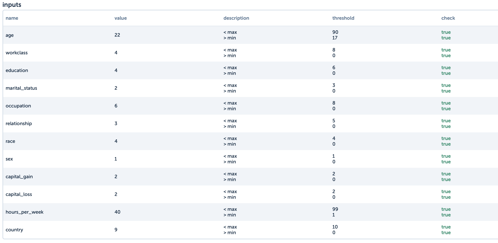
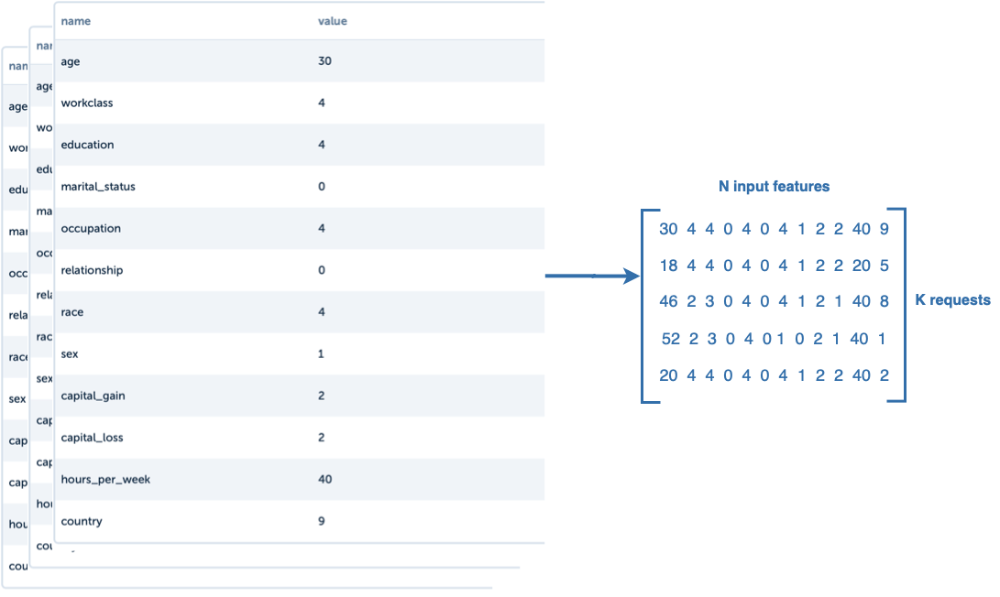
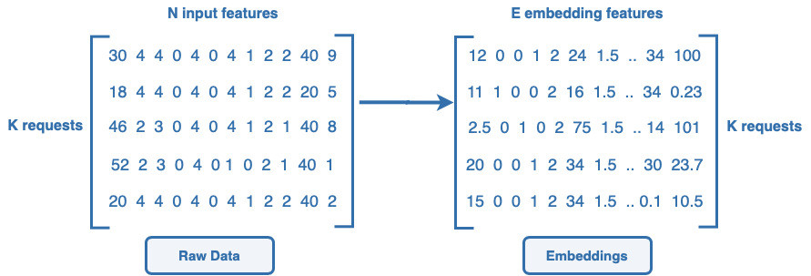
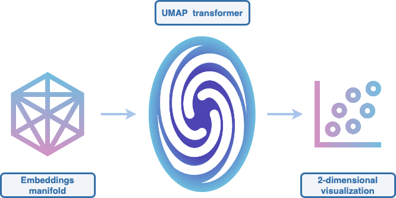
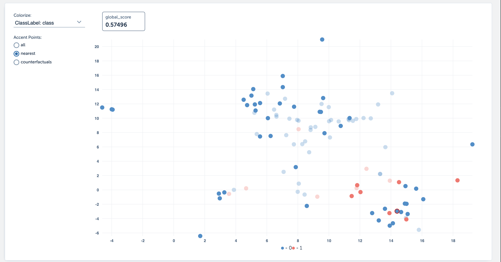

# Hysrosphere visualization service
Visualization in general is a very important tool, which helps to describe complex things in a simple way. One good visualization can show more than text or data. Monitoring of machine learning models is a hard task which requires analysing a lot of raw data: training data, production requests and model outputs. All this data is basically just numbers which in their original form of vectors and matrices do not have any meaning for us or at least it is hard to extract any meaning from thousands of vectors of natural numbers. In hydrosphere we want to make monitoring easier and clearer that is why we created a visualization service that can show you all your requests in one plot. 

Consider production data, this is how one request looks like for classification model:

It is very convenient to check what request consists of and compare inputs with other request. 

Now, imagine you have 2000 of such tables of requests. Is it even possible? With hydro-visualization tool you can do it.

# How?
Each request is a N-dimensional vector of features, we can consider it as a matrix where each row is a N-dimensional request. 

Usually we do not use raw features in our models, let's apply some simple preprocessing methods for tabular data such as one-hot encoding, standard scaling of some features and so on. After preprocessing we get embeddings of this data that have even more dimensions (usually E ≥ N). 

Each row here is just a point in E-dimensional space, usually this E is greater than 3. All requests are just some group of clusters in this space summing up to a manifold of points. So it is extremely hard to imagine such data in high dimensionality.  

To visualize this in 2D we can use dimensionality reduction techniques such as UMAP. UMAP is a new method to transform points from high-dimensional space to a lower space with the smallest loss of information.  It tries to preserve clusters, local and global structure of manifold so that points that are close in original space are also close in lower space.

You can consider UMAP transformer as a portal from high-dimensional embeddings space to 2D space. When embeddings manifold passes through portal it is transformed to a 2D points such a way that it still looks similar to itself.

In our service it looks the following way: 

Point presents one request that was sent to your model. Each point is colored by class model has assigned to it. If you choose some point you can see the exact inputs to model, predicted class, prediction confidence and monitoring scores. You can explore what clusters data has, what points are considered as outliers. 

Visualization also provides information about

- Visualization of all production requests embeddings with various colorings:
    - Colouring based on model prediction
    - Colouring based on model confidence in predictions
    - Colouring based on scores of your monitoring models
- Closest requests to specific request
- Closest counterfactuals to specific request
- All information about request

# Why do you need it? 

# How to use it

## 1. Create Model and Application

Create your model, which will receive some inputs and return outputs which contain field `embedding`. Embedding should be a 1 D vector.  Upload your model using command `hs upload`. 

For more accurate transformation add training data in your serving.yaml file. You can also add monitoring model. If you do so, in visualization you can find gradient coloring of each request according to monitoring score.

## 2. Send data to your model

Send  requests to your model using  GRPC predict requests  or SDK. 

## 3. Go to UI

Got to your embeddings model In UI. In `visualization` tab you can see  visualization of your requests embeddings.

# Limitations

- only tabular data for now
- need production requests